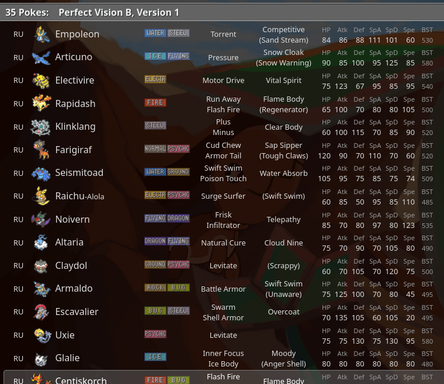

# 35 Pokes Extension

This is a browser extension that modifies exposed data in the Pokemon Showdown Client to achieve functionalities supporting the 35 Pokes community.

> [!NOTE]
> Metagame data is maintained in a separate, dedicated repository: [35 Pokes Index](https://github.com/swordfishtr/35PokesIndex)

## Features

- Format selection much like the kind that the client provides. This is the place to generate a challenge code, or turn the extension on/off.

- Turns the preferred teambuilding format, `NDAG`, into the selected 35 Pokes metagame. Every other format, like `NDOU`, is unaffected by this.

- Selecting another metagame is immediately reflected in the teambuilder.

- Certain 35 Pokes metagames can customize data like Pokemon BST, typing, learnsets, abilities etc.

- For past gen 35 Pokes metagames, the teambuilder and in-battle tooltips display the correct move data and indicate moves that were changed.

- There is no performance cost for all of these!

## Extension store links

**Firefox (desktop and mobile):** https://addons.mozilla.org/en-US/firefox/addon/35-pokes-extension/

**Chrome:** https://chromewebstore.google.com/detail/35-pokes-extension/imalbmpbodookapofcilbmmahhjanhba

## TODO

- [ ] Support item add/ban/set in meta rules.

- [ ] Modify calc data for past gen metas.

- [ ] Local, user created metagames - create, modify, delete, sort, custom chal code, import/export json.

## History

@samuel-peter-chowdhury and @hannahfantasia are the authors of the original browser extension supporting the 35 Pokes community. It utilized a MutationObserver to detect any list of pokemon on the screen and hide all but the allowed ones, which proved very costly performance wise with up to 4 sec UI block on mobile.

Later Sam devised a solution to this by editing a part of the source code of the client to suit the community's needs, and making the extension redirect the browser to this code.

Sam and I then looked into various means to ease the burden on maintainers, since this edited code wouldn't update itself alongside the client source. We also wanted to be inclusive of any other browser extension utilizing the same method in the future. Technically it was possible, but the means at the time were unreliable, so we settled with the original solution.

Soon after, I found that the client exposes a bunch of data, mostly under names starting with `Battle`, with write access. I was able to modify format data, learnsets, BSTs etc. using the browser console. If it's possible to fulfill the community's needs just like that, then this method is much preferable for everyone involved.
